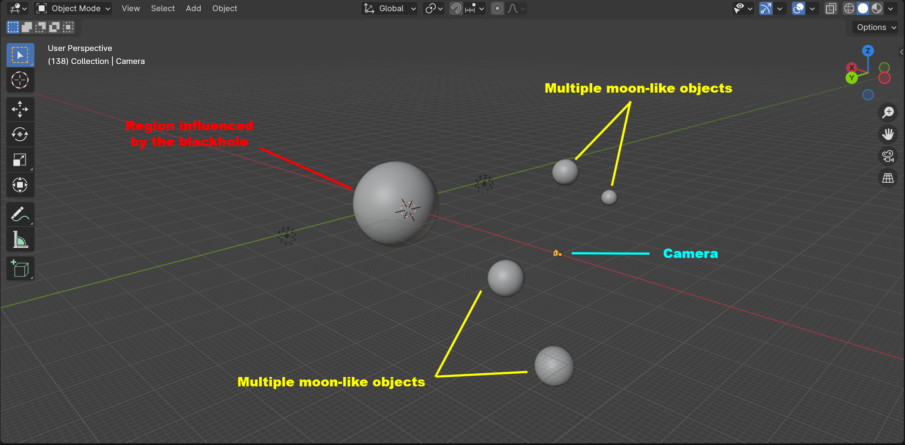
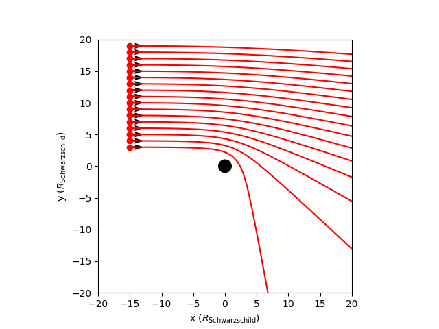
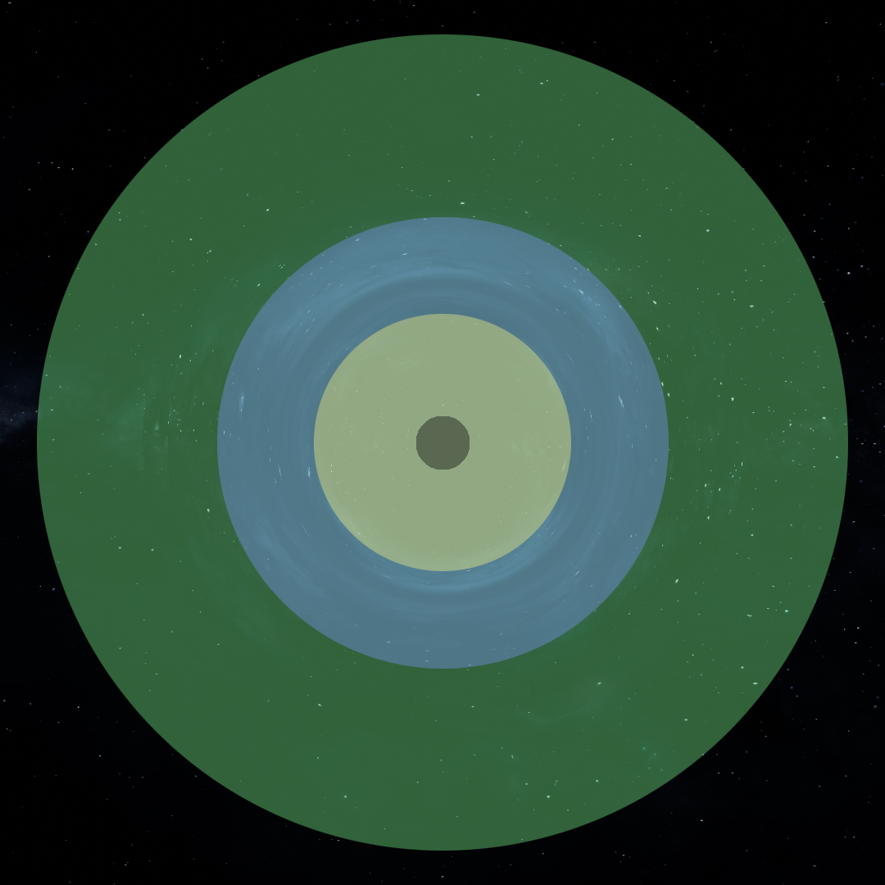
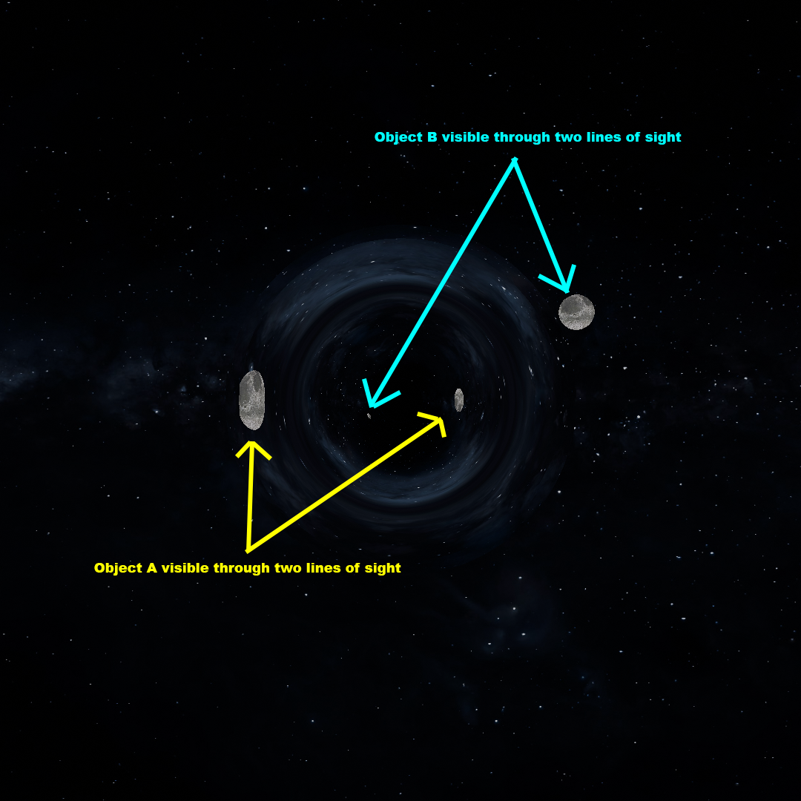

# Tracing rays around blackholes – A render engine for curved space-times in Blender

## Introduction

Einsteins theory of general relativity is the theory that describes gravity, blackholes and the structure of our cosmos. In this theory energy curves space-time and in turn this curvature determines how matter as well as light moves. This means that if we want to properly make an image of a blackhole in Blender, we must include curvature in our ray tracing. I made a first version of a custom render engine that implements Einstein theory. And since I am an astrophysicist, I want it to be scientifically correct. No tricks, no effects and no shortcuts. Let me show you how I am using scientific techniques to build a custom engine that renders a realistic blackhole in a Blender scene.

|  | 
|:--:| 
| *Figure 1:* |

|  | 
|:--:| 
| *Figure 2:* |

|  | 
|:--:| 
| *Figure 3:* |

## How it works - conceptually
Before we go into the math and physics, lts conceptually try to understand what happens in Fig. 1-3. The renders in Fig. 1-3 are made using a very simple Blender scene setup shown in Fig. 4. The scene contains a region in which space-time is curved due to a blackhole in the center (the blackhole is about 1/60th in size compared to the sphere in Blender). The other four small spheres are the moon-like objects you see in the animation. And then there is a camera. That is all (note there is also an HDRI image not visible in the 3d view of Fig. 4).

|  |
:--:| 
| *Figure 4: Blender 3d scene view for the animations in Fig. 1 and 2*|

What the render engine does is outside the blackhole sphere of influence (indicated with red in Fig. 4) it uses the ray_cast function implemented in Blender. Thus outside this sphere the space-time is flat. When the ray hits the sphere the hit location and direction are passed to the general relativistic ray tracer. This calculates how the light ray is continued in the curved space-time until it hits the boundary of the sphere again. It then gives back the location and direction with which it exits the sphere. From here on the ray_trace function in Blender is again used to continue the ray tracing.

||
|:--:| 
| *Figure 5:*|

In Fig. 5 examples are given in two dimensions of what happens inside the sphere where the space-time is curved. The rays start at x=-15 $R_{\text{Schwarzschild}}$ and at different y values and travel in the positive x direction. The blackhole in the center of the sphere is shown as a black disk in Fig. 5. You can see that the closer the ray passes the blackhole the stronger the deflection. You can also see that the ray that passes closest to the blackhole gets deflected by almost 90 degrees! In Fig. 6 I show rays that pass even closer to the blackhole and you see that the deflection can result in a complete turn around of the light ray. Also some light rays pass too close and are absorbed by the blackhole.

||
|:--:| 
| *Figure 6:*|

With the insights of Fig. 4-6 we can now interpret the animations and images in Fig. 1-3 better. I roughly devided the image of the blackhole with only an HDRI in four regions in Fig. 7. In the outer green region you have very mild deflection of the lines of sight. In the blue region the lines of sight are more curved and lens the background galaxy in a circle around the center. In the yellowish region the curvature is so strong that the lines of sight can angle 90 degrees or more outwards (see fig. 5 for examples). In these cases you see the HDRI to the right/left/top/bottom sides of the blackhole or even de HDRI behind the camera (see the rays in Fig. 6). The inner black region is totally black because the lines of sight end on the blackhole.

||
|:--:| 
| *Figure 7:*|

You can see even better how the lines of sight are deflected when the moon-like object fly passed and behind the blackhole. You can often see these objects through two lines of sight, see Fig. 8. You see one of the moons to the left of the blackhole, but also smaller and more deformed to the right. This image on the right formes from lines of sight that are deflected by angles of the order of 90 degrees, like you see in Fig. 5.

||
|:--:| 
| *Figure 8:*|

## How it works - math!
If you are interested in a rundown on the maths (I tried to keep it to a level that you only need some (vector) calculus and linear algebra to follow the concepts), have a look here: [The_math_and_physics_behind_curvedpy.ipynb](tutorials/The_math_and_physics_behind_curvedpy.ipynb)

So lets start with Newtons second law. In flat space the motion of bodies (in the classical limit) is described by the second law of Newton:

$$
\frac{d^2 x}{dt^2} = F/m
$$

Where F is the net force acting on the body, m is the body's mass and x is the location of the body. If no force is acting on the body this reduces to:

$$
\frac{d^2 x}{dt^2} = 0
$$

Which states that the velocity of the body is constant and $x(t)$ is a linear function of time. Or in other words, the body follows a straight line.

For the code I have implemented I have used techniques from several peer-reviewed paper, among which:
* <a href="https://arxiv.org/abs/1801.10452" target="_blank">Bronzwaer et al 2018: https://arxiv.org/abs/1801.10452 </a>
* <a href="https://arxiv.org/abs/2303.15522" target="_blank">Davelaar et al 2023: https://arxiv.org/abs/2303.15522 </a>
* <a href="https://arxiv.org/abs/2302.02733" target="_blank">Moscibrodzka et al 2023: https://arxiv.org/abs/2302.02733 </a>

## Goals and milestones

## Use it yourself
### Examples
* For a tutorial and example on how to use curvedpy see: [Curvedpy_tutorial_and_examples.ipynb](tutorials/Curvedpy_tutorial_and_examples.ipynb)

### Installation
Net avaliable yet, coming soon

