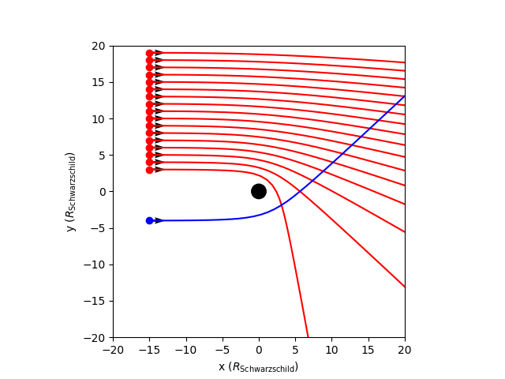

# Tracing rays around blackholes – A render engine for curved space-times in Blender

Author: <a href="https://www.linkedin.com/in/bldevries/" target="_blank">BL de Vries</a>

## Introduction

Einsteins theory of general relativity is the theory that describes gravity, blackholes and the structure of our cosmos. In this theory energy curves space-time and in turn this curvature determines how matter as well as light moves. This means that if we want to properly make an image of a blackhole in Blender, we must include curvature in our ray tracing. I made a first version of a custom render engine that implements Einstein theory. And since I am an astrophysicist, I want it to be scientifically correct. No tricks, no effects and no shortcuts. Let me show you how I am using scientific techniques to build a custom engine that renders a realistic blackhole in a Blender scene.

|  | 
|:--:| 
| *Figure 1: a (Schwarzschild) blackhole moving in from the left. There is only a background of stars and interstellar dust. When the blackhole moves in you can see how it warps and lenses the background.* |

|  | 
|:--:| 
| *Figure 2:* |

|  | 
|:--:| 
| *Figure 3:* |


## How it works - conceptually
Before we go into the math and physics, lets conceptually try to understand what happens in Fig. 1-3. The renders in Fig. 1-3 are made using a very simple Blender scene setup shown in Fig. 4. The scene contains a region in which space-time is curved due to a blackhole in the centre (the blackhole is about 1/60th in size compared to the sphere in Blender). The other four small spheres are the moon-like objects you see in the animation. And then there is a camera. That is all (note there is also an HDRI image not visible in the 3d view of Fig. 4).

|  |
:--:| 
| *Figure 4: Blender 3d scene view for the animations in Fig. 1 and 2*|

What the render engine does is outside the blackhole sphere of influence (indicated with red in Fig. 4) it uses the ray_cast function implemented in Blender. Thus, outside this sphere the space-time is flat. When the ray hits the sphere the hit location and direction are passed to the general relativistic ray tracer. This calculates how the light ray is continued in the curved space-time until it hits the boundary of the sphere again. It then gives back the location and direction with which it exits the sphere. From here on the ray_trace function in Blender is again used to continue the ray tracing.

||
|:--:| 
| *Figure 5: a two-dimensional example of how rays are traced by the curvedpy python package. 17 rays all start at x = -15 R_Schwarzschild, indicated by a red dot. The black arrow shows the initial direction of the ray. In red you see the calculated ray path. The black disk at the origin represents the blackhole's Schwarzschild radius, also known as the event horizon. The Schwarzschild radius is given by 2GM/c^2 and is thus determined by the mass of the blackhole.*|

In Fig. 5 examples are given in two dimensions of what happens inside the sphere where the space-time is curved. The rays start at x=-15 $R_{\text{Schwarzschild}}$ and at different y values and travel in the positive x direction. The blackhole in the centre of the sphere is shown as a black disk in Fig. 5. You can see that the closer the ray passes the blackhole the stronger the deflection. You can also see that the ray that passes closest to the blackhole gets deflected by almost 90 degrees! In Fig. 6 I show rays that pass even closer to the blackhole, and you see that the deflection can result in a complete turnaround of the light ray. Also, some light rays pass too close and are absorbed by the blackhole.

||
|:--:| 
| *Figure 6: the same as Fig. 5 but with rays passing much closer to the blackhole. This shows that the deflection of rays by the curvature of space around a blackhole can be so extreme as to completely reverse the direction of the ray.*|

With the insights of Fig. 4-6 we can now interpret the animations and images in Fig. 1-3 better. I roughly divided the image of the blackhole with only an HDRI in four regions in Fig. 7. In the outer green region, you have very mild deflection of the lines of sight. In the blue region the lines of sight are more curved and lens the background galaxy in a circle around the centre. In the yellowish region the curvature is so strong that the lines of sight can angle 90 degrees or more outwards (see fig. 5 for examples). In these cases, you see the HDRI to the right/left/top/bottom sides of the blackhole or even de HDRI behind the camera (see the rays in Fig. 6). The inner black region is totally black because the lines of sight end on the blackhole.

||
|:--:| 
| *Figure 7: roughly subdividing the area around the blackhole based on how rays are effected. The inner rays fall into the blackhole, and the image is black. Surrounding this region (yellow) is a region of very strong curvature and deflection of the rays. The pixels in this region can come from light coming from behind the camera or completely to the side. The blue region shows strong lensing of the background and the outer region in green shows the least deflection compared to the other areas.*|

You can see even better how the lines of sight are deflected when the moon-like object fly passed and behind the blackhole. You can often see these objects through two lines of sight, see Fig. 8. You see one of the moons to the left of the blackhole, but also smaller and more deformed to the right. This image on the right forms from lines of sight that are deflected by angles of the order of 90 degrees, like you see in Fig. 5.

||
|:--:| 
| *Figure 8: this render shows how one object can be visible through two lines of sight. The moon-like objects are behind the blackhole, and you can see the on both sides of the blackhole. The image of the object at the outside of the blackhole comes from minimally deflected rays, while the image of the same object closer to the blackhole and on the other side comes from strongly deflected lines of sight.*|


## How it works - code organisation
As of now the code is in development. The idea for the general structure of the code is to have a Python package (called curvedpy) which can be installed using pip and a Blender add-on with the render engine that can be installed in Blender. The Python package does the ray tracing in curved space-time, which means solving the differential equations and any optimalizations therefor. The Blender render engine will interface with Blender and deal with the scene information and the traditional ray tracing in flat space. This code structure might change depending on how I will incorporate rendering of objects inside curved space-time. This might require less separation between the curved and flat ray tracing.

## How it works - physics & math!
This section is for those interested in the physics and maths. I will loosely explain how the path travelled by bodies in four-dimensional space-times is calculated given a metric. I will leave out most of the math and proper definitions. It needs to be readable by people that have studied some calculus and mechanics. If you have studied some General Relativity and/or differential geometry, please keep the goal of the oversimplifications I make in mind. :) 

### Trajectories in space-time: the geodesic equation
So, let’s start with Newtons second law. In flat space the motion of bodies (in the classical limit) is described by the second law of Newton:

$$
\frac{d^2 x}{dt^2} = F/m
$$

Where F is the net force acting on the body, m is the body's mass and x is the location of the body. If no force is acting on the body this reduces to:

$$
\frac{d^2 x}{dt^2} = 0
$$

Which states that the velocity of the body is constant and $x(t)$ is a linear function of time. Or in other words, the body follows a straight line.

In General Relativity a similar equation as the second law of Newton exists and is called the geodesic equation:

$$
\frac{d^2 x^{\alpha}}{d\tau^2} + \Gamma^{\alpha}_{\mu \nu} \frac{d x^{\nu}}{d\tau} \frac{d x^{\mu}}{d\tau} = 0
$$

This equation describes the motion of a body in four-dimensional space (thus including time). At first sight this equation does not look similar to Newtons second law but let’s have a look. As with Newtons equation the $x$ describes the location of the body. Here $x^{\alpha}$ is the location of the body in four dimensional space. $x^{0}$ is the time coordinate and $x^{1}$, $x^{2}$ and $x^{3}$ are the spatial coordinates. You see that $\alpha$ (just as $\mu$ and $\nu$) is an index of the four-vector $x^{\alpha}$

Now $\frac{d^2 x^{\alpha}}{d\tau^2}$ is the second derivative of the four-location $x$ to the parameter $\tau$. Here $\tau$ serves the function that time does in Newtons equation. The solution of the geodesic equation is thus $x(\tau)$, which describes a path in four-space. If the second term:

$$\Gamma^{\alpha}_{\mu \nu} \frac{d x^{\nu}}{d\tau} \frac{d x^{\mu}}{d\tau}$$

would not exist, the geodesic equation would reduce to Newtons equation (with F=0) and taking $\tau = x^{0} = t$. 

The term with $\Gamma$ adds the effect of curved space to the geodesic equation and with that the geodesic equation becomes an equation that describes straight lines in curved space.

(Note to self: Add more information on different and equivalent definitions of a straight line?)

The $\Gamma$ encodes all information of the curvature of space and these numbers are called Christoffel Symbols or Connection Symbols. They are calculated and defined as:

$$\Gamma^{\sigma}\_{\mu \nu} = \frac{1}{2} g^{\sigma \rho} (\partial\_{\mu} g_{\nu \rho} + \partial\_{\nu} g\_{\rho \mu} - \partial\_{\rho} g\_{\mu \nu})$$

Where $g_{\mu \nu}$ is the space-time metric. In short it encodes the length of between two points in space-time and is a part of the inner product between vectors.

Even though you have used the metric of flat Euclidean space many times, you might not have realized. This is because the metric in Euclidian space is:

$$
G_{\text{flat}} = 
\begin{bmatrix}
1 & 0 & 0\\
0 & 1 & 0\\
0 & 0 & 1\\
\end{bmatrix}
$$

Here I have written the metric in Matrix notation. (For the connoisseur, the metric is a rank-2 tensor $g_{\sigma \rho}$). And the metric is part of the length of a vector through the inner product. The the length of a vector $\vec{V}$ is:

$$
\vec{V}\cdot\vec{V} = \vec{V}^{T} G_{\text{flat}} \vec{V} = \vec{V}^{T} \vec{V} = v_1^2 + v_2^2 + v_3^3
$$

Here we use standard matrix multiplication, $\vec{V}^{T}$ is the transpose of $\vec{V}$ making it a row vector and the components of $\vec{V}$ are $(v_1, v_2, v_3)$. And you see it all kind of ends with Pythagoras theorem, and you see why you might never have heard of the metric. 

A nice example of a more complicated metric in a familiar setting is that of the surface of a sphere. If you are interested in what this metric looks like and how you can use it, see my blog [Calculating lengths in curved spaces using SymPy’s symbolic mathematics, Python and Matplotlib](https://medium.com/@bldevries/calculating-lengths-in-curved-spaces-using-sympys-symbolic-mathematics-python-and-matplotlib-7c18da99fd7b).

### A blackhole metric

One of the metrics implemented in curvedpy is the Schwarzschild metric that describes space-time around a spherically symmetric blackhole. In Spherical coordinates this looks like:

$$
g_{\sigma \rho} = 
\begin{bmatrix}
-(1-\frac{r_s}{r}) & 0 & 0 & 0\\
0 & \left(1-\frac{r_s}{r}\right)^{-1} & 0 & 0\\
0 & 0 & r^2 & 0\\
0 & 0 & 0 & r^2 \sin^2(\theta)
\end{bmatrix}
$$

The package curvedpy uses the Schwarzschild metric in cartesian coordinates. To show this we create a SchwarzschildGeodesic class:

```SW = cp.SchwarzschildGeodesic()```

And we can show the metric by typing:

```SW.g```

The Christoffel Symbols $\Gamma$ are calculated using sympy and an example can be generated by typing:

```SW.gam_y```

To see this working, check out the [jupyter notebook](tutorials/The_math_and_physics_behind_curvedpy.ipynb) version of this text.

## How it works - numerical
For the code I have implemented I have used techniques from several peer-reviewed papers and books, among which:
* <a href="https://arxiv.org/abs/1801.10452" target="_blank">Bronzwaer et al 2018: https://arxiv.org/abs/1801.10452 </a>
* <a href="https://arxiv.org/abs/2303.15522" target="_blank">Davelaar et al 2023: https://arxiv.org/abs/2303.15522 </a>
* <a href="https://arxiv.org/abs/2302.02733" target="_blank">Moscibrodzka et al 2023: https://arxiv.org/abs/2302.02733 </a>
* A first course in general relativity. Bernard Schutz
* Spacetime and geometry. Carroll

Let me briefly explain how I solve the geodesic equation. The geodesic equation is a not quite linear second order differential equation, so we need to use some numerical techniques to tackle it. The scipy packages has some nice integrators which we can use through the function ```solve_ivp```. For a simple example of how you can use this function check out my blog [Simply solving differential equations using Python, scipy and solve_ivp](https://medium.com/@bldevries/simply-solving-differential-equations-using-python-scipy-and-solve-ivp-f6185da2572d). 

For ```solve_ivp``` to work we need to split the geodesic equation in first order equations by introducing the "velocity" $k^{\mu}$:

$$
\frac{d k^{\alpha}}{d \lambda} = 
\text{ } -\Gamma^{\alpha}_{\nu \mu} \text{ }
k^{\mu} \text{ } 
k^{\nu}
$$

$$
\frac{d x^{\beta}}{d\lambda} = k^{\beta}
$$

Now we can integrate these equations (these are 8 equations since the indices can take on 4 values) if we have an initial condition for the location $x$ and the "velocity" $k$. Or in other words, we need to have a beginning location and direction of movement. The integration of the geodesic equation is done in the function ```calc_trajectory```.


## Goals and milestones
Ray Tracer
* Add the ability to render objects *inside* the curved space-time region
* Add a disk to the blackhole
* Add a metric that spans the whole scene

Optimalization
* Parallelization
* Tensorflow model or interpolation of some of the calculations

Useability:
* Add Blender UI to the render engine
* Finalise the python package and upload to PyPi
* Make the render engine a proper add-on to Blender 

## Use it yourself
### Examples
* For a tutorial and example on how to use curvedpy see: [Curvedpy_tutorial_and_examples.ipynb](tutorials/Curvedpy_tutorial_and_examples.ipynb) (coming soon!)

### Installation
Not available yet, coming soon

