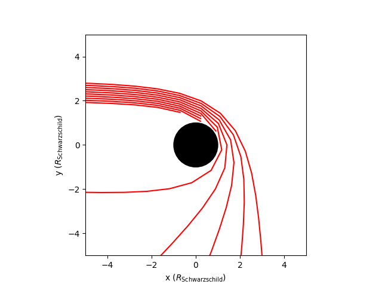

# General Relativistic Ray Tracer for Blender

## Introduction

## How it works

* For a simple math and physics explanation of what curvedpy does, see: [The_math_and_physics_behind_curvedpy.ipynb](tutorials/The_math_and_physics_behind_curvedpy.ipynb)

## Use it yourself

Under construction.

* For a tutorial and example on how to use curvedpy see: [Curvedpy_tutorial_and_examples.ipynb](tutorials/Curvedpy_tutorial_and_examples.ipynb)

## Goals and milestones

## Installation

Net avaliable yet, coming soon

## Known bugs

